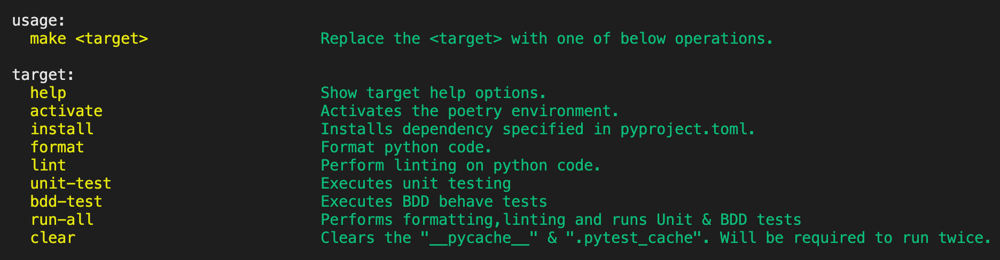

# zero-2-hero-python-flask-microservice
This is repository will contain a very basic flask get api &amp; deploy it to the EKS flavour of kubernetes using Concourse Pipeline.

## Execution

Currently you can perform following operations with in this repo.

