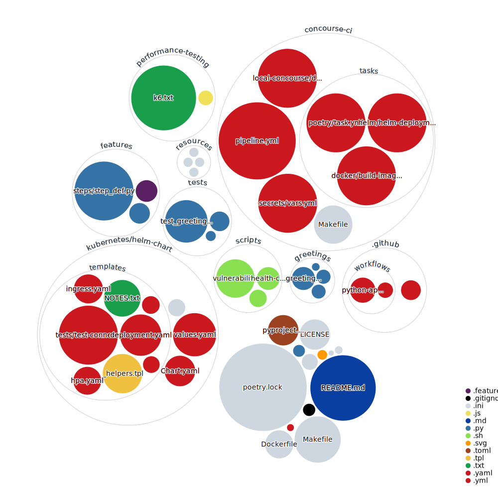
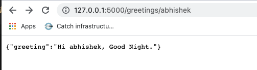

# zero-2-hero-python-flask-microservice

## Introduction

**Instruction on how to use this repo is still a work in progress.**

This repository is developed to demonstrate how a typical business requirement transforms into software code by following the cloud-native practices.

The app exposes a get endpoint with a very simple logic as described below in Gherkins syntax:

```
Feature: Based on the current time the API will greet the invoker

Scenario: When user passes their name to the API
    Given the user "Abhishek" wants to be greeted
    When the user invokes the API
    And Morning time is between "4" and "12"
    And Afternoon time is between "12" and "17"
    And Evening time is between "17" and "20"
    And Night time is between "20" and "4"
    Then the user should be greeted with either "Hi Abhishek, Good Morning." or "Hi Abhishek, Good Afternoon." or "Hi Abhishek, Good Evening." or "Hi Abhishek, Good Night."
```

The codebase can be better visualized as below:



## Pre-requisite

* Python 3.9.5 or higher
* Poetry
* Docker
* FLY CLI (For the CI/CD hands-on)
* Docker Hub Credentials (CI/CD pipeline requires it for pushing the image to docker hub)
* AWS EKS Cluster & credentials(For deploying this application using the CI/CD pipeline)

Note: If you running behind a corporate proxy you or the pipeline may not be able to pull some of the dependencies from the internet.

Github Action pipeline status for tests and dependency vulnerabilities: [](https://github.com/abhisheksr01/zero-2-hero-python-flask-microservice/actions/workflows/pipeline.yml)
## Local Execution

From the root of this directory execute below commands:

#### Activating Poetry shell env
```
make activate

or 

poetry shell
```

#### Installing dependencies required for running the app
```
make install

or 

poetry install
```
#### Start Application

```
make start

or

python3 run.py
```

Once the app has started you should be able to access the app Endpoint at http://127.0.0.1:5000/greetings/[YOUR_NAME]



---

If your system doesn't support make commands, look into the [Makefile here](./Makefile) & get the raw commands to execute the tasks.

---

You can execute commands to execute operations like unit test, e2e test, vulnerability scanning etc.


## Local Docker Execution

If you wish to use docker for running the app locally the execute below commands:

Build docker image:
```
docker build -t greetings-app .
```

Run docker image:
```
docker run --rm -it -p 5000:5000 greetings-app
```

Now your app should be accessible at http://127.0.0.1:5000/greetings/[YOUR_NAME]

## Local Concourse Pipeline
[Concourse](https://concourse-ci.org/) is an open-source continuous thing-doer.

Built on the simple mechanics of resources, tasks, and jobs, Concourse presents a general approach to automation that makes it great for CI/CD.

Let us quickly spin a concourse pipeline locally and before proceeding make sure you have Docker installed.

From the root of the project change the directory:
```
cd concourse-ci
```
Execute the below command to spin a local concourse tool:
```
make spin-concourse
```
If you use a macOS M1 the above command will not work, use this command for m1:
```
make spin-concourse-m1
```
or if Make is not supported
```
cd local-concourse

docker compose up -d
```

Access the local concourse using the URL http://127.0.0.1:8080/ and then download the FLY CLI utility from the concourse home page.

---
> **_For Windows:_** 

- Execute the fly.exe as Administrator & then add "C:\Program Files\concourse\fly.exe" to the PATH environment variable.
- You will have to replace the "/" with "\" appropriately and "." from the front of any path references.

---

Update the credentials in the [secrets/vars.yml](./concourse-ci/secrets/vars.yml)

From concourse-ci directory execute the below command to configure the pipeline job.
```
make set-pipeline
```
or if Make is not supported
```
fly -t main set-pipeline -p zero-2-hero-python-flask-microservice -c pipeline.yml -l ./secrets/vars.yml
```
If you have fly installed and the make set-pipeline returns an error, make sure you "allow" it to run within Privacy and Security setting of your mac system setting.

Authenticate the pipeline by clicking the link highlighted in CLI with **USERNAME/PASSWORD as admin/admin**.

Then approve the pipeline configuration by typing "y" and hit enter.

You might get an error related to the fly version is not sync, if so execute the command recommended in CLI to do so.

By default, all the pipelines in the concourse are paused, execute the below command to unpause the same.

```
fly -t main unpause-pipeline -p zero-2-hero-python-flask-microservice
```
The pipeline can be accessed using the URL http://127.0.0.1:8080/teams/main/pipelines/zero-2-hero-python-flask-microservice

Your pipeline should look something like this:


Additionally, you can perform below make commands concerning the concourse CI/CD pipeline.


Execute the below command to destroy the pipeline:
```
make destroy-pipeline
```
or if Make is not supported
```
fly -t main destroy-pipeline -p zero-2-hero-python-flask-microservice
```

Execute the below command to tear off the local concourse:
```
make destroy-concourse
```
or if Make is not supported
```
cd local-concourse 

docker compose down
```
