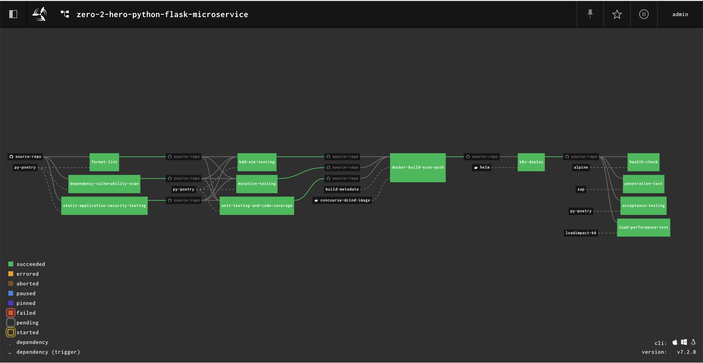

# zero-2-hero-python-flask-microservice

## Introduction

**Instruction on how to use this repo is still work in progress.**

This repository is developed with a intention to demonstrate how a typical business requirement transforms into software code by following the cloud native practices.

## Pre-requisite

* Python 3.9.5 or higher
* Poetry
* Docker
* FLY CLI (For the CI/CD hands on) 
* Docker Hub Credentials (CI/CD pipeline requires it for pushing the image to docker hub)
* AWS EKS Cluster & credentials(For deploying this application using the CI/CD pipeline)

Note: If you running behind corporate proxy may not be able to pull some of the dependencies from internet.

## Local Execution

Currently you can perform following operations with in this repo.

## Local Concourse Pipeline

Make commands for executing the software locally:

Make commands for the CI/CD pipeline:
